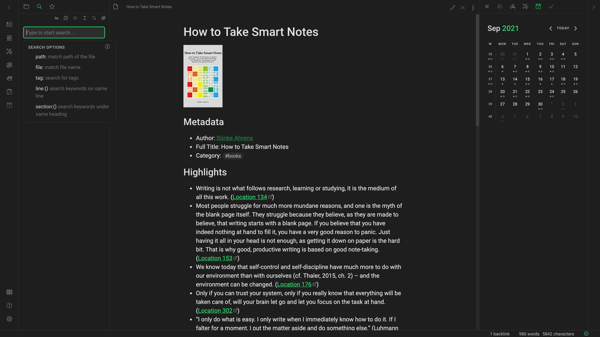

  <h1 align="center">
    
     
    Creature Obsidian Theme
  </h1>
  <h4 align="center">Creature is a minimal and dark-only theme for night dwellers.</h4>
  

  

 

## Design principles

- **Optimized for focused work:** Creature is meant for deep work and aims to remove distractions so that you can perform your best work.
- **Minimal use of colors:** Creature uses colors sparingly and with intent, to draw attention to primary actions and within workflows.

## Install manually

1. Download `obsidian.css` from the this repository.
1. Rename the file to `Creature.css`, to make sure that it has a unique name.
1. Move the file into your vault's `/.obsidian/themes` directory.
1. In Obsidian, open **Preferences** -> **Appearances**.
1. Set **Base theme** to **Dark**.
1. Under **Themes**, click the **Theme** drop-down and select **Creature**.
